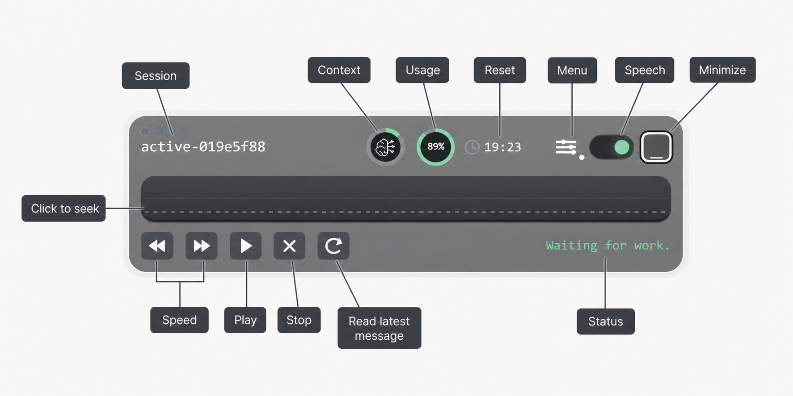

<p align="center">
  
</p>

# QDex

QDex is a compact Windows overlay that reads new visible Codex responses aloud.

It watches local Codex session logs, follows the active session, and speaks only newly appended assistant messages. It does not call a language model, summarize text, or send Codex output to an API.

## Features

- Tracks the newest Codex session under `%USERPROFILE%\.codex\sessions`
- Reads only new visible assistant output after QDex attaches
- Skips command output, tool logs, history, context rows, and reasoning rows
- Shows observable activity such as tool calls, commands, patches, replies, and usage updates
- Displays local usage/reset status from Codex `token_count` events
- Supports Edge Neural TTS and Windows Local TTS
- Can publish an optional local broadcast for other apps that want to react to QDex output
- Requires no API keys for supported speech engines
- Hides to the Windows system tray while continuing to listen
- Runs as a compact transparent always-on-top Tauri overlay

<p align="center">
  
</p>

## Install

Packaged Windows builds run directly and do not require Node.js or Rust.

Download the Windows installer from GitHub Releases when a release asset is published, then run:

```text
QDex_0.1.0_x64-setup.exe
```

If the repository was cloned or downloaded as source code, use the build-from-source steps below.

## User Requirements

- Windows 10 or later
- A local Codex installation that writes session logs under the current Windows account

## Development Requirements

These are only needed for development or building from source:

- Node.js 22 or later
- Rust stable toolchain

## Run From Source

```powershell
npm install
npm run dev
```

QDex starts with speech enabled and automatically attaches to the newest available Codex session.

## Configuration

Machine-local settings can be provided through `.env`. The file is ignored by Git.

```powershell
Copy-Item .env.example .env
```

If Codex logs are stored outside the default location, set:

```text
QDEX_CODEX_SESSIONS_ROOT=C:\path\to\sessions
```

QDex is first a reader: it watches Codex output and speaks it aloud. It can also publish a small local broadcast so another app can react to what QDex just saw or spoke, for example to reuse the generated audio.

This broadcast is enabled by default and does not change speech behavior.

```text
%USERPROFILE%\.qdex\broadcast.jsonl
```

Set `QDEX_BROADCAST_ENABLED=0` to disable these broadcasts. The path can be overridden with `QDEX_BRIDGE_DIR` and `QDEX_BROADCAST_PATH`.

## TTS Engines

The current QDex release supports two speech engines:

- Edge Neural TTS for online neural voices without an API key
- Windows Local TTS for built-in offline SAPI voices

## Build From Source

```powershell
npm install
npm run build
```

The release executable is written to:

```text
src-tauri\target\release\qdex.exe
```

The Windows installer is written to:

```text
src-tauri\target\release\bundle\nsis\QDex_0.1.0_x64-setup.exe
```

Build output is ignored by Git.

## Notes

- Previous Codex output is not read when QDex attaches to a session.
- Markdown code blocks are reduced before speech to avoid reading long blocks of punctuation.
- Speech cleanup normalizes inline code, local paths, URLs, extensions, common acronyms, and code symbols into TTS-friendly French or English text. Internal Codex directives are omitted.
- Edge Neural TTS uses Microsoft Edge Read Aloud endpoints and does not require an API key.
- The status line is limited to observable saved events and does not expose hidden model reasoning.
- Planned follow-up work is tracked in [TODO.md](TODO.md).

## License

QDex is licensed under GPL-3.0-only. See [LICENSE](LICENSE).

Third-party dependency notices are summarized in [THIRD_PARTY_NOTICES.md](THIRD_PARTY_NOTICES.md).
